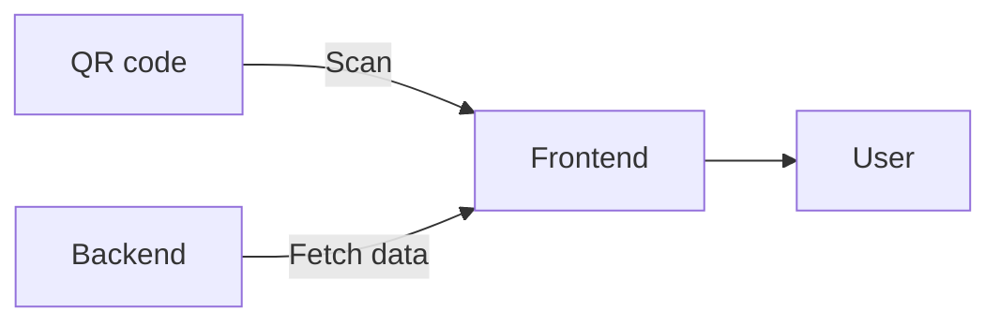
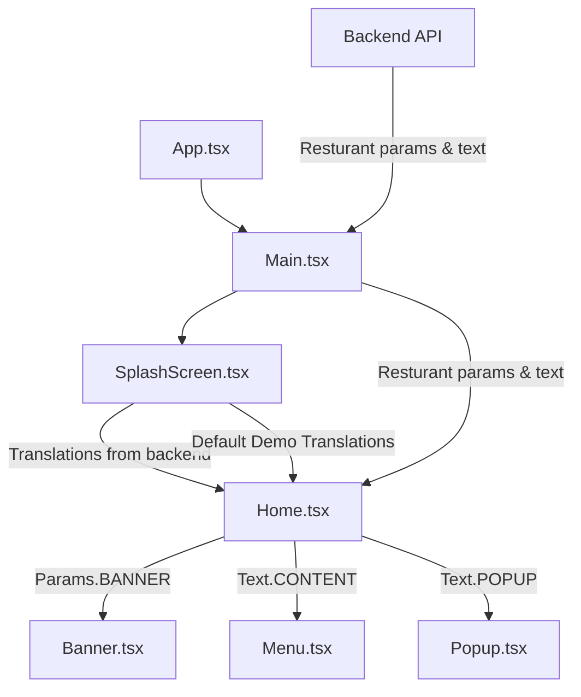

### Project flow

```mermaid
flowchart LR
    A[QR code]--Scan-->B[Frontend]
    C[Backend]--Fetch data-->B
    B-->D[User] 
```
### UI Flow

```mermaid
flowchart TD
    A[App.tsx]-->B[Main.tsx];
    Z[Backend API] --Resturant params & text--->B;
    B-->C[SplashScreen.tsx];
    C--Translations from backend-->D[Home.tsx];
    C--Default Demo Translations-->D;
    B--Resturant params & text-->D;
    D--Params.BANNER-->E[Banner.tsx];
    D--Text.CONTENT-->F[Menu.tsx];
    D--Text.POPUP-->G[Popup.tsx]; 
```