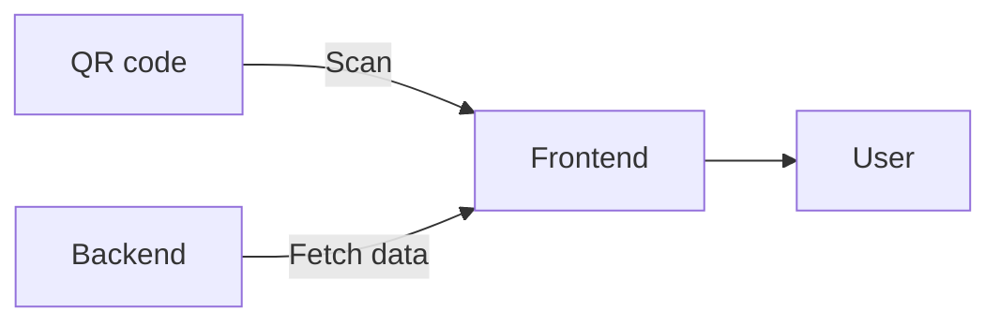
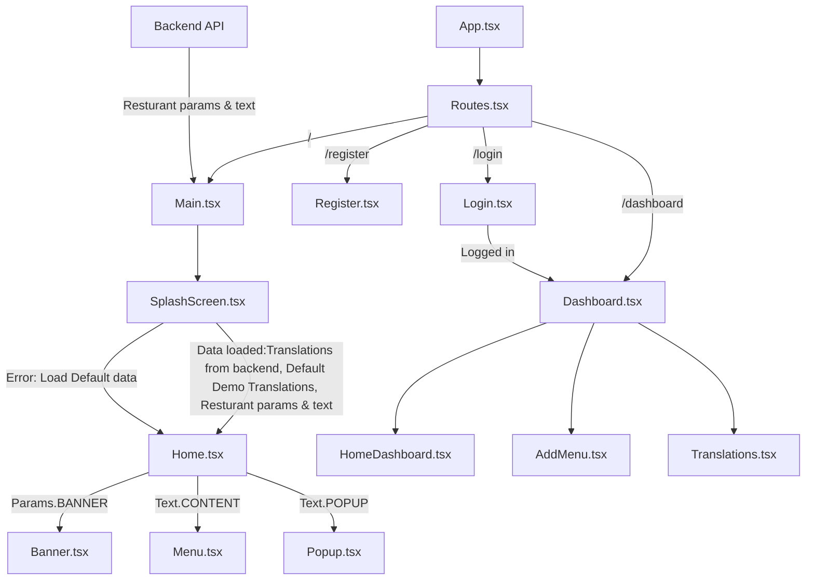

### Project flow

```mermaid
flowchart LR
    A[QR code]--Scan-->B[Frontend]
    C[Backend]--Fetch data-->B
    B-->D[User] 
```
### UI Flow

```mermaid
flowchart TD
    A[App.tsx]-->B[Routes.tsx];
    B--/login-->L[Login.tsx]
    B--/register-->R[Register.tsx]
    B--/dashboard-->D[Dashboard.tsx]
    L--Logged in-->D
    B--/-->M[Main.tsx]
    M-->S[SplashScreen.tsx];
    S--Data loaded:Translations from backend, Default Demo Translations, Resturant params & text-->H[Home.tsx];
    S--Error: Load Default data-->H
    H--Params.BANNER-->Y[Banner.tsx];
    H--Text.CONTENT-->W[Menu.tsx];
    H--Text.POPUP-->X[Popup.tsx]; 
    Z[Backend API] --Resturant params & text--->M;
    D-->HomeDashboard.tsx
    D-->DM[AddMenu.tsx];
    D-->Translations.tsx
```